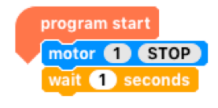

# Physical Computing

## EGGbot

### Inspiration

Three inspirations for this project **Eggbot**:
1. [http://www.instructables.com/id/Plastic-Egg-Bot/](http://www.instructables.com/id/Plastic-Egg-Bot/)

1. Femi Owolade supported by Nic Hughes ran a session at Mozilla Festival 2016 using the Crumble's to make a wheeled robot.

1. The junkbot project [https://junkbots.blogspot.co.uk/](https://junkbots.blogspot.co.uk/)

### Kit

-   Kinder Egg (without the Chocolate and toy)

-   Crumble Controller available at [https://redfernelectronics.co.uk/shop/](https://redfernelectronics.co.uk/shop/)

-   4x Crocodile clips and leads

-   Battery pack and 3xAA batteris

-   Vibrating motor or small DC motor with a weight added to the axel

-   Tape (lots of)

-   Pens

-   Paper

-   Scissors

-   Glue and Gluegun (optional)

### Stage1: Fix the vibrating motor into the Egg.

Put the vibrating motor into the Egg with the motor electrical connections sticking out the bottom larger half of the egg. 

Make sure the unbalanced load is free to move -- this is bit that causes the vibrations needed to move the egg. The motor can be held in place by sticky-tack or strong tape, or glue (when using glue this is done under adult supervision only)

### Stage 2: Sticking the pens on

This is the trickiest bit. The easiest way to do is cut a strip of tape.

Place two pens onto the tape ensuring the pens are the same length from the tape to the nib and the distance between the pens on the tape are far enough apart to place the egg between them.

If you are using three pens, the third pen should be placed so that all three form a triangle with equal sides, that means the egg can stand-up on a piece of paper on the pen nibs, without anything supporting it.

If you are using four pens, the other two pens should be placed so that all four form a square with equal sides, that means the egg can stand-up on a piece of paper on the pen nibs, without anything supporting it.

### Stage 3: Add the battery pack and go.

Using two wires connecting the battery, to the motors. Remove the nibs and set the bot off. It is hopefully vibrating and shaking and
scribbling lines on the paper.

To see one in action go to: [https://www.youtube.com/watch?v=NRlntdmdQRo](https://www.youtube.com/watch?v=NRlntdmdQRo)

### Stage 3: Add Control (sort of) Crumble

1. Disconnect the battery connection (the connections on the motor can stay as they are). 
2. Connect the USB cable to the Crumble. 
3. To the right of theUSB connect there are two connections marked + and -:
   - Connect a Red wire to the + connection and the other end to the red wire of the battery pack. 
   - Connect a black wire to the -- connection and the other end to the black wire of the battery pack.

On the Crumble, on the right-side there are two motor connections connect the Motor to these connections. Don't worry about which of the motors wires is need you swap them around later.

### Stage 4: ALet's start programming it

The software can be found at [https://redfernelectronics.co.uk/crumble-software/](https://redfernelectronics.co.uk/crumble-software/) it includes how to set it up on your own machine.

Start the Crumble software. Drag from the left the Program start, motor, and wait blocks. Now join the up start block at the top and the motor block next and the wait block last.

Your code should look like this:

Click on the stop within the motor block. It should change to forward.

Now you are ready to make it move. Press the green arrow and with the battery pack on, it should (hopefully) keep moving.

If you put a second motor block after the wait block with the stop in the block. It such then stop after 1 second of moving.

### Stage 5: Making it do more

1. Drag a do-until block in (found in the control menu). 
2. Go to variable menu and add a new variable, I have used `t`, select the block marked `let=`, and drag a `t` into the blank space. 
3. Drag an increase block onto the screen and drag a `t` into the blank space.

Go to the operator menu and drag onto the screen an `=` block, go back to variables menu and drag a `t` into the first space on the `=` block and click on the second space on the block and type in `5`.

Now for the challenge put all these together to copy what is shown below. Now, put the egg-bot on the paper, with the pen lids off, press the green triangle and the motors should be spun in different directions.

This is a junkbot so it may just cause the bot to move a slightly  different directions but hopefully it should just draw some squiggly lines.

# Computational Thinking

## Thomas's Tangles

A recently released book Teaching Computing Unplugged in Primary Schools
edited by Helen Caldwell (University of Northampton) and Neil Smith
(Open University) has a number of interesting chapters by authors who
are passionate about how computing is taught in schools. The central
theme is unplugged activities, without using computers, but still teach
the fundamental of computational thinking.

Ok, confession time. I co-wrote, along with Katharine Childs (Raspberry
Pi Foudation), Chapter 3 Artists so I am biased here, but I believe in
the central theme of Unplugged Computing. Computing, and Computational
Thinking in general, is not just about programming and using a computer
(though using computers and programming are vitally important to
Computing) but it is also about many other things including
problem-solving, being creative and working collaboratively.

Chapter 3 is about linking these computational thinking ideas to produce
visual art, by applying computing principles including repetition,
following and refining algorithms, and abstraction. The chapter also
looks, how these links have already being made, with examples such Sol
Le Witt where not all the work that was produced by the artist himself,
but some by others following his written instructions - in other words
an algorithm. There is even a game Thomas's Tangles

The other chapters make links with areas such as Robots, Musicians,
Explorers, Magicians, Gamers, Cooks and Scientists.